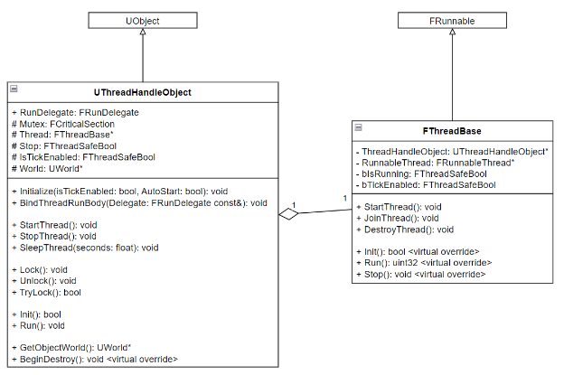
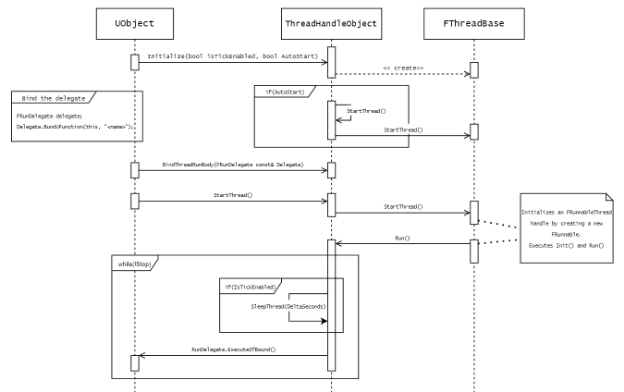

# ThreadHandleObject
Unreal Engine 5.3 plugin to create and handle threads.

Thread Handle Object Technical Documentation 

THREAD HANDLE OBJECT

TECHNICAL DOCUMENTATION

TABLE OF CONTENTS

1. [Introduction ................................................................................................................... 3 ](#_page2_x70.00_y72.00)
1. [Target Audience ........................................................................................................... 3 ](#_page2_x70.00_y216.00)
1. [Product Objectives ....................................................................................................... 3 ](#_page2_x70.00_y317.00)
1. [Design Goals.................................................................................................................. 3 ](#_page2_x70.00_y432.00)
1. [Design Flow .................................................................................................................... 4 ](#_page3_x70.00_y72.00)
1. [Logical Behaviour ......................................................................................................... 5 ](#_page4_x70.00_y72.00)
1. [Process View .................................................................................................................. 6 ](#_page5_x70.00_y72.00)
1. [Use Case View............................................................................................................... 7 ](#_page6_x70.00_y72.00)

1. **Introduction** 

During the development of my capstone team project in the third year of the Game Development program at Algonquin College, I developed a **UObject** wrapper for spawning and managing threads in Unreal Engine C++. The **ThreadHandleObject** is a simple UObject subclass that can be initialized like a normal ActorComponent or Actor inside any UCLASS. This document provides an architectural overview of the system and also functions as a foundational reference point for the developers. 

2. **Target Audience** 

This document is intended for technical stakeholders, particularly the development team, and assumes that the reader has a basic technical background in Unreal Engine C++. 

3. **Product Objectives** 

The **ThreadHandleObject** aims to provide a user-friendly wrapper for FRunnable threading framework inside Unreal Engine, keeping raw C++ code separate from Unreal C++ framework, customizable threading framework, and stable code execution using mutex locking. 

1. **Design Goals** 

The design goals for creating the **ThreadHandleObject** are: 

- Easy to initialize and create threads and stay inside the Unreal Engine Framework. 
- Provide thread looping functionality such as **is Tick enabled**, and **start on initialize**. 
- Wrap around the raw C++ code in the FRunnable class. 
- Provide functions for mutex locking and unlocking. 
2. **Design Flow** 

The basic ThreadHandleObject execution consists of 4 steps: 

1. **Initialization** 

2. **Binding the Run Thread Body** 

3. **Starting the Thread** 

4. **Running the Thread** 

1. **Logical Behaviour** 

The main class, **UThreadHandleObject** is an Object of the Unreal Engine framework. It consists of one FThreadBase pointer, initialized in the Initialize() function. The FThreadBase is a subclass of FRunnable, overriding some basic functions, including Init, Run, and Stop. 

2. **Process View** 

3. **Use Case View** 

The first step is to create the ThreadHandleObject. Like any UObject, it is created in the constructor of an owning UObject: 

Before spawning a thread, the ThreadHandleObject must be initialized. The initialization can be done from any function: 

The first argument in the Initialize() function is to set IsTickEnabled. The second argument is for whether to auto start the thread or not. 

**Note:** The auto-start option will not do anything until a function is bound to the **RunDelegate**. 

The ThreadHandleObject requires a function bound to its RunDelegate to utilize the multi-threading functionality. 

If auto start is enabled, the ThreadHandleObject will start executing the bound function. To start the threading process, simply call the StartThread() function. 

You can utilize the mutex locking and unlocking like so: 

And…. 

8 | P a g e 
